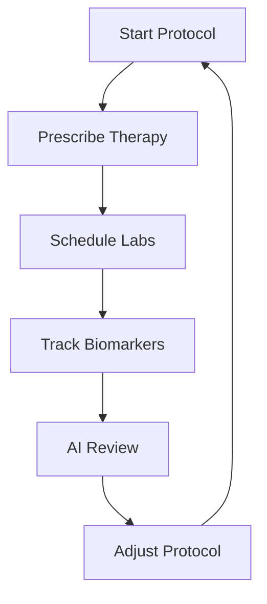

## Overview

MyDose delivers a unified platform for protocol-based longevity care. You manage long-term treatment plans with tools for clinics, patients, telehealth, and AI integration. Key capabilities include clinical software for providers, a patient health app, protocol timelines, and an AI layer for insights.

<Callout kind="info">
MyDose connects clinics, patients, and AI to streamline integrative and regenerative medicine workflows.
</Callout>

<Columns cols={2}>
  <Card title="Clinical Software" icon="user" href="#clinical-software">
    Handle intake, appointments, and provider workflows.
  </Card>
  <Card title="Patient App" icon="smartphone" href="#patient-app">
    Log symptoms and view health trends.
  </Card>
  <Card title="Protocol Timelines" icon="calendar" href="#protocol-timelines">
    Track prescriptions and labs over time.
  </Card>
  <Card title="AI Insights" icon="zap" href="#ai-layer">
    Get context-aware recommendations.
  </Card>
</Columns>

## Clinical Software

Use MyDose Clinical Software to manage patient intake and appointments efficiently.

### Intake and Appointments

Streamline onboarding with digital forms and scheduling.

<Steps>
  <Step title="Create Intake Form" icon="file-text">
    Build custom forms for patient history and biomarkers.

````tsx
// Example: Fetch intake form template
const response = await fetch('https://api.example.com/v1/forms/intake', {
  headers: { Authorization: `Bearer ${YOUR_API_KEY}` }
});
const formTemplate = await response.json();
````

  </Step>
  <Step title="Schedule Appointment" icon="calendar">
    Integrate with calendars for telehealth or in-clinic visits.
  </Step>
  <Step title="Review Data" icon="check-circle">
    Access consolidated patient data before consultations.
  </Step>
</Steps>

## Patient Health App

Patients use the MyDose app to log symptoms and monitor trends.

<Tabs>
  <Tab title="Symptom Logging" icon="activity">
    Patients record daily symptoms with timestamps.

````javascript
// Log symptom via API
await fetch('https://api.example.com/v1/symptoms', {
  method: 'POST',
  headers: {
    'Content-Type': 'application/json',
    Authorization: `Bearer ${YOUR_TOKEN}`
  },
  body: JSON.stringify({
    patientId: 'patient-123',
    symptom: 'fatigue',
    severity: 5,
    timestamp: new Date().toISOString()
  })
});
````

  </Tab>
  <Tab title="View Trends" icon="trending-up">
    Visualize biomarker and symptom patterns over time.
  </Tab>
</Tabs>

## Protocol Timelines

Track prescriptions, labs, and interventions on interactive timelines.



<ParamField path="protocolId" param-type="string" required="true">
  Unique protocol identifier for timeline access.
</ParamField>

<ParamField query="startDate" param-type="date" required="false">
  Filter timelines by start date.
</ParamField>

## AI Layer

The AI layer provides context-aware insights from patient data.

<CodeGroup tabs="JavaScript,Python">
```javascript
// Request AI recommendations
const insights = await fetch('https://api.example.com/v1/ai/insights', {
  method: 'POST',
  headers: { Authorization: `Bearer ${YOUR_API_KEY}` },
  body: JSON.stringify({ patientId: 'patient-123', protocolId: 'proto-456' })
});
```
```python
import requests

response = requests.post(
    'https://api.example.com/v1/ai/insights',
    headers={'Authorization': f'Bearer {YOUR_API_KEY}'},
    json={'patientId': 'patient-123', 'protocolId': 'proto-456'}
)
```
</CodeGroup>

<ResponseField name="recommendations" field-type="array" required="true">
  Suggested protocol adjustments.
</ResponseField>

<ResponseField name="riskScore" field-type="number">
  Calculated risk based on trends.
</ResponseField>

<Expandable title="Advanced AI Configuration" default-open="false">
Configure custom AI models for specific protocols.

| Model Type | Use Case | Latency |
|------------|----------|---------|
| Biomarker | Lab trend analysis | `<1s` |
| Symptom | Pattern detection | `2-5s` |
| Protocol | Adjustment suggestions | `10s` |

</Expandable>

<Callout kind="tip">
Start with protocol timelines to see immediate value, then integrate AI for personalized care.
</Callout>