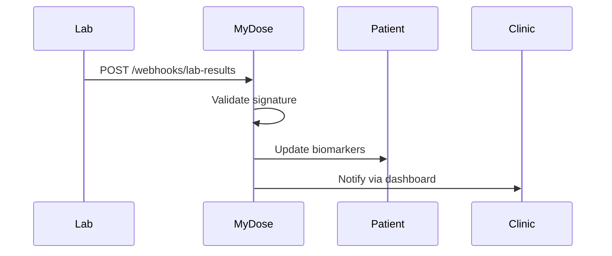

## Overview

MyDose supports seamless integrations with lab services, telehealth platforms, and custom APIs to streamline your protocol-based care. Connect biomarker tracking systems for automatic data import, sync appointments with telehealth tools, and use webhooks for real-time updates. These connections enable unified patient records across your clinic's ecosystem.

<Callout kind="info">
Enable integrations in your MyDose dashboard under `Settings > Integrations`. Generate API keys and configure endpoints as needed.
</Callout>

<Columns cols={2}>
  <Card title="Lab Services" icon="test-tube" href="#labs">
    Connect Quest, LabCorp, or custom labs for biomarker syncing.
  </Card>
  <Card title="Telehealth" icon="video" href="#telehealth">
    Integrate Zoom, Doxy.me for appointment workflows.
  </Card>
  <Card title="Webhooks" icon="zap" href="#webhooks">
    Receive real-time patient data updates.
  </Card>
  <Card title="Partner API" icon="code" href="#api">
    Build custom extensions with full API access.
  </Card>
</Columns>

## Lab and Biomarker Integrations

Set up lab connections to automatically import results into patient protocols. MyDose supports HL7 FHIR standards and direct API integrations with major providers.

<Steps>
  <Step title="Generate API Key" icon="key">
    Navigate to `Settings > Integrations > Labs` and create a new connection.
  </Step>
  <Step title="Configure Lab Endpoint">
    Enter the lab's API base URL and your credentials.
  </Step>
  <Step title="Map Biomarkers">
    Select biomarkers like `hsCRP`, `HbA1c` to sync with MyDose protocols.
  </Step>
  <Step title="Test Connection" icon="check-circle">
    Run a test import to verify data flow.
  </Step>
</Steps>

```javascript
// Example lab result payload
{
  "patientId": "mdose_12345",
  "biomarkers": {
    "hsCRP": 1.2,
    "HbA1c": 5.4
  },
  "timestamp": "2024-10-15T10:00:00Z"
}
```

## Telehealth and Scheduling Integrations

Integrate telehealth tools to sync appointments directly into MyDose protocols.

<Tabs>
  <Tab title="Zoom" icon="video">
    <Steps>
      <Step title="OAuth Setup">
        Authorize MyDose in your Zoom app marketplace.
      </Step>
      <Step title="Webhook Mapping">
        Map Zoom events to MyDose appointments.
      </Step>
    </Steps>
  </Tab>
  <Tab title="Calendly" icon="calendar">
    Use Calendly webhooks to trigger protocol updates on booking.
    
````javascript
// Calendly webhook payload example
{
  "event": "invitee.created",
  "payload": {
    "event": {
      "id": "evt_abc123",
      "start_time": "2024-10-20T14:00:00Z"
    }
  }
}
````
  </Tab>
</Tabs>

## Webhooks for Real-Time Sync

Expose a webhook endpoint in MyDose to receive events from external systems.

<Callout kind="tip">
Secure your webhook with HMAC signatures using your secret key.
</Callout>



<CodeGroup tabs="Node.js,Python">
````javascript
// Node.js webhook handler
const crypto = require('crypto');
app.post('/webhooks/lab-results', (req, res) => {
  const signature = req.headers['x-signature'];
  const payload = JSON.stringify(req.body);
  const expected = crypto.createHmac('sha256', process.env.WEBHOOK_SECRET)
    .update(payload).digest('hex');
  if (signature === `sha256=${expected}`) {
    // Update MyDose patient record
    res.status(200).send('OK');
  } else {
    res.status(401).send('Unauthorized');
  }
});
````
````python
# Python webhook handler (Flask)
import hmac
import hashlib
from flask import Flask, request

app = Flask(__name__)
SECRET = 'your-webhook-secret'

@app.route('/webhooks/lab-results', methods=['POST'])
def webhook():
    signature = request.headers.get('X-Signature')
    payload = request.get_data()
    expected = hmac.new(
        SECRET.encode(), payload, hashlib.sha256
    ).hexdigest()
    if signature == f'sha256={expected}':
        # Update MyDose record
        return 'OK', 200
    return 'Unauthorized', 401
````
</CodeGroup>

<ParamField path="webhook_secret" param-type="string" required="true">
Your secret for HMAC validation. Generate in dashboard.
</ParamField>

<ParamField header="X-Signature" param-type="string" required="true">
HMAC SHA256 signature of the payload.
</ParamField>

## Partner API Access

Access the MyDose Partner API for custom integrations at `https://api.mydose.ai/v1/`.

<Request tabs="cURL,JavaScript">
```bash
curl -X POST https://api.mydose.ai/v1/patients \
  -H "Authorization: Bearer YOUR_API_KEY" \
  -H "Content-Type: application/json" \
  -d '{
    "externalId": "lab_123",
    "biomarkers": {"hsCRP": 1.2}
  }'
```

````javascript
const response = await fetch('https://api.mydose.ai/v1/patients', {
  method: 'POST',
  headers: {
    'Authorization': 'Bearer YOUR_API_KEY',
    'Content-Type': 'application/json'
  },
  body: JSON.stringify({
    externalId: 'lab_123',
    biomarkers: { hsCRP: 1.2 }
  })
});
````
</Request>

<Response tabs="200">
```json
{
  "success": true,
  "patientId": "mdose_12345",
  "updated": "2024-10-15T10:00:00Z"
}
```
</Response>

## Next Steps

<Columns cols={2}>
  <Card title="API Reference" icon="book-open" href="/api-reference">
    Full endpoint documentation.
  </Card>
  <Card title="Troubleshooting" icon="help-circle" href="/troubleshooting">
    Common integration issues.
  </Card>
</Columns>